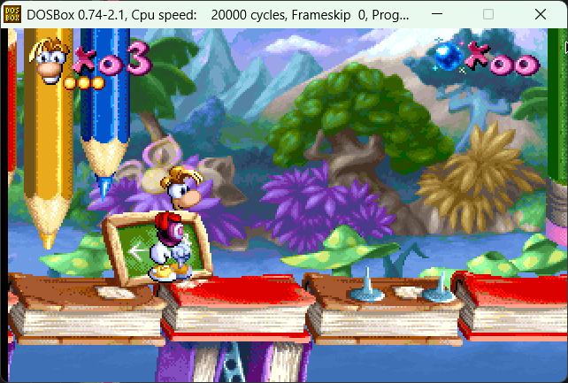

# Rayman 1 Map Repacker

The **Rayman 1 Map Repacker**, Ray1MapRepacker for short, is a tool which allows modifying the map and tilesets of levels.

Here's an example of an edit to showcase what you can do:

## How to use it

### General usage

The tool is a command-line tool, meaning it has no user interface and has to be run from the Command Prompt.

To run it, open a Command Prompt window in the same folder as the exe (by typing `cmd` in the address bar) and type any of the following commands:

- `Ray1MapRepacker -e <level-path> <output-path>`: Exports the tileset and map from the level to the output path. A separate tileset PCX file is exported per available palette.
- `Ray1MapRepacker -i <level-path> <input-path>`: Imports the tileset and map to the level from the input path. The files have to be named the same as when exporting. Only the first tileset PCX will be used for the tiles. The rest will only be used to import alternative palettes.

For example, use `Ray1MapRepacker -e "C:\GOG Games\Rayman Forever\Rayman\PCMAP\JUNGLE\RAY1.LEV" "Maps"` to extract the map and tileset from the first level from a GOG installation into a folder named "Maps".

Make sure to keep a backup of the files before modifying them!

### Editing

After extracting you will end up with the following files:

- **LevelMap.map**: This is the map, stored in the same format as Rayman Designer stores its `EVENT.MAP` files. This means you can copy the files back and forth between them.
- **TileSet.pcx**, **TileSet_1.pcx** & **TileSet_2.pcx**: This is the tileset, stored as a PCX image file. There are 3 separate versions because levels can have 3 separate palettes. So while the tiles are the same across each file they will each use one of the available palettes.

To edit the map you can replace a custom map in Rayman Designer with it and edit it using the Mapper. Alternatively [Ray1Editor](https://github.com/RayCarrot/Ray1Editor) can be used to edit levels.

To edit the tileset it is highly recommended to use a program such as Gimp which can edit PCX files while retaining the original palette. If you prefer using a different tool for image editing then you can modify your tiles in another program and then copy them over the tileset using Gimp. This will replace it while updating the colors to use the ones from the existing palette.

For the PCX files you can use any width or height as long as they're multiples of 16 and the total tile count does not exceed 1200. If you want the tiles to be aligned in Ray1Editor like they are in the PCX file then a width of 384 is recommended.

When importing the modified PCX file it will only use the first one to get the tiles. The second and third are only used for alternative files and aren't required for importing.

### Memory error

If the game crashes with the error `Memory error in block_malloc` when loading a modified level then it's most likely because the level is too big to fit into the game's memory. This can be resolved by increasing the memory pool in the game. For this you first need to decompress the exe, then you can edit it with a hex editor by searching for the bytes `00 7C 08 00` and replacing them with a higher value. For example, you can double it to `00 F8 10 00`.

If you come across any other issues then please let me know!
